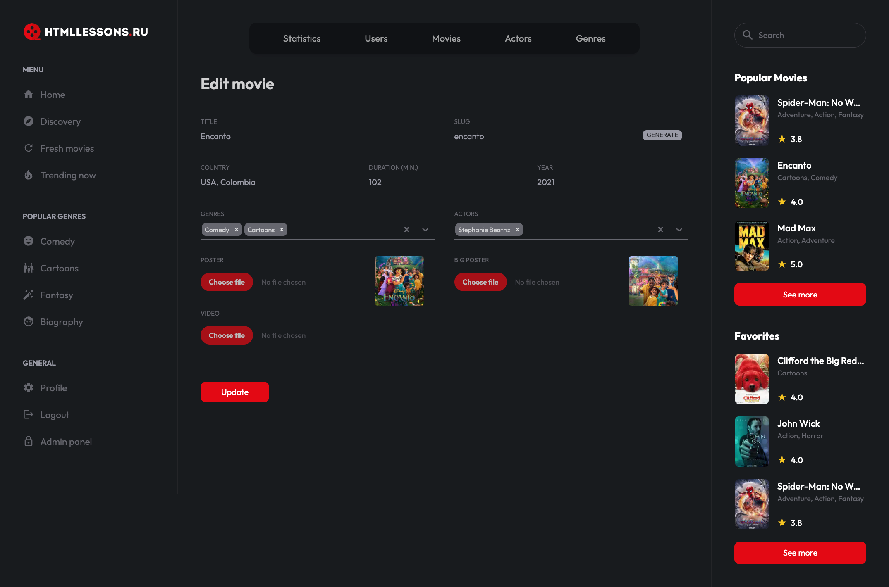
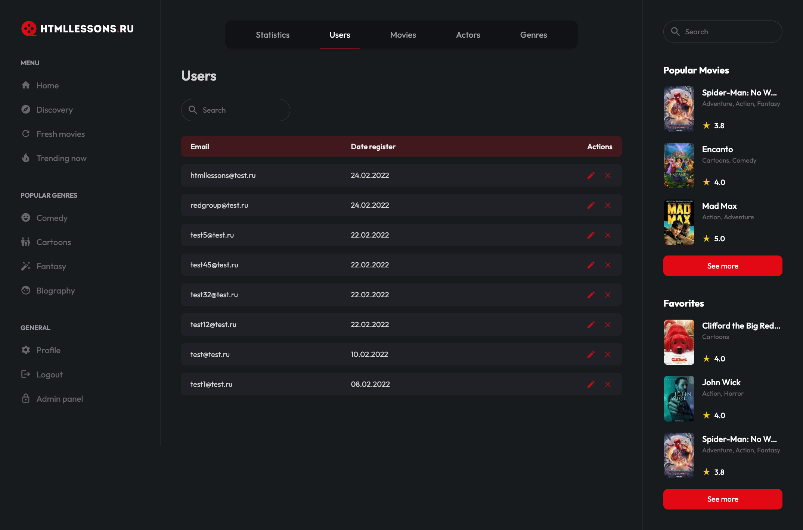
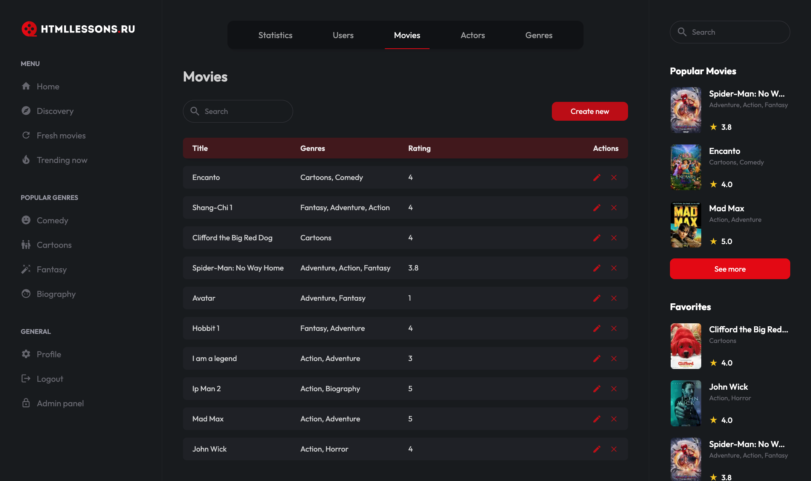
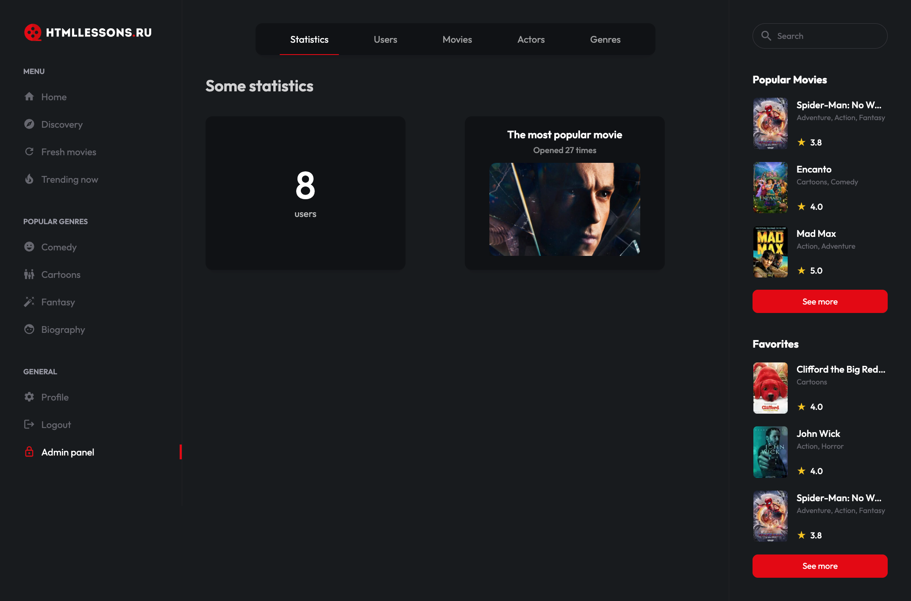
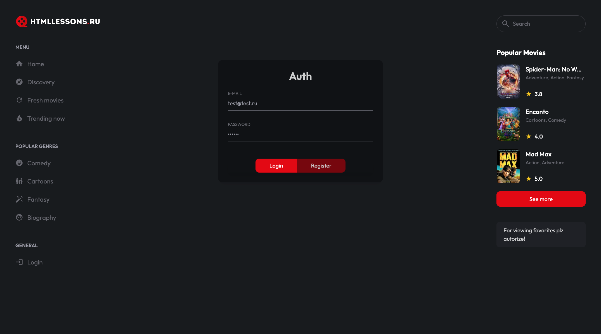
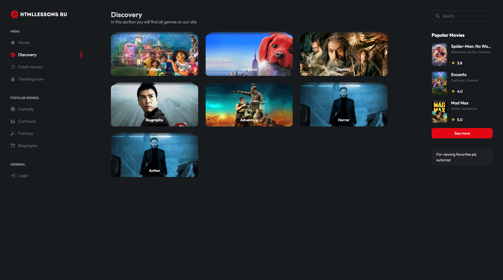
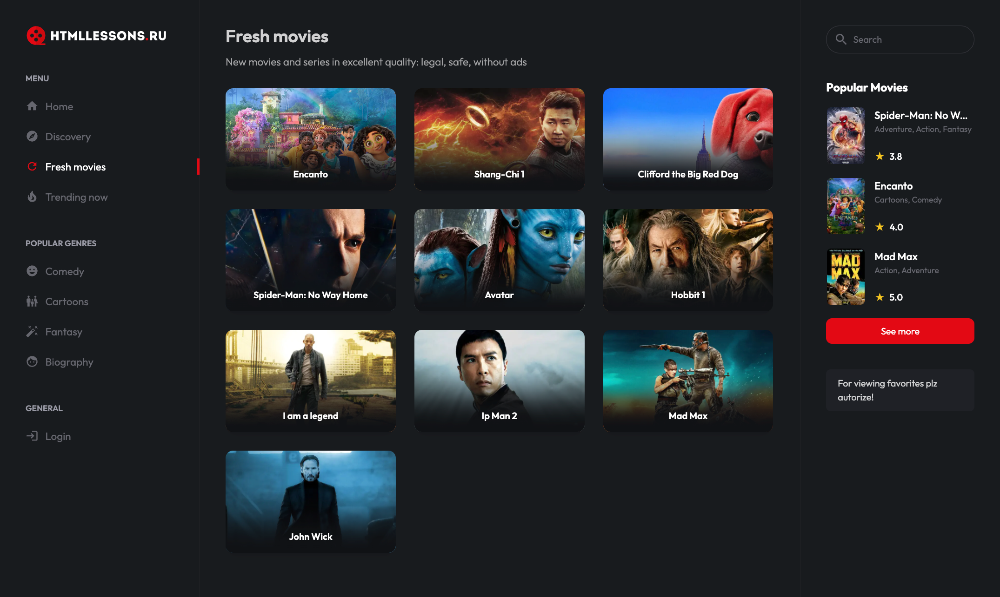
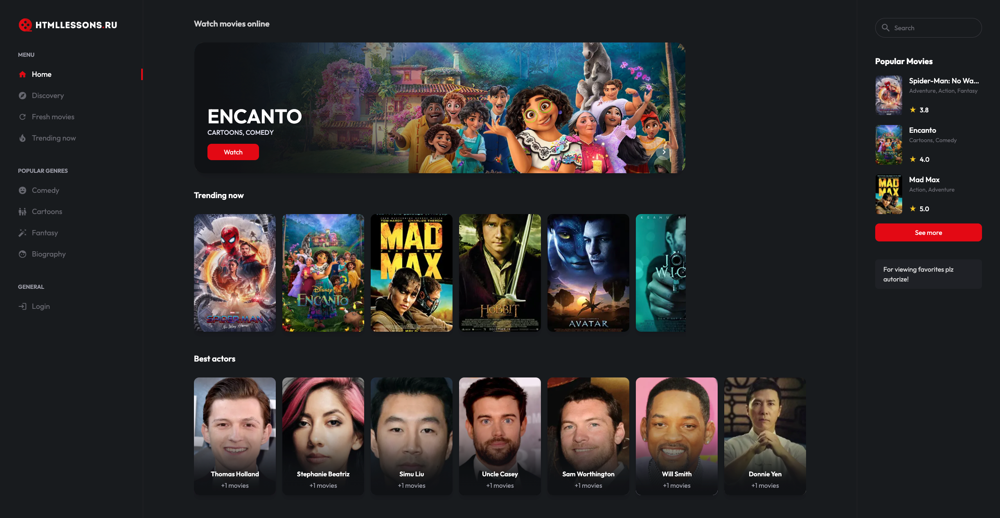
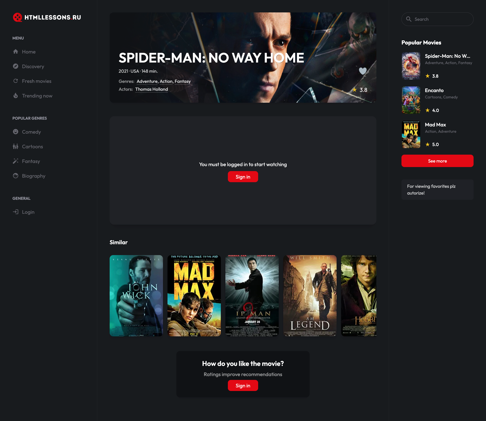
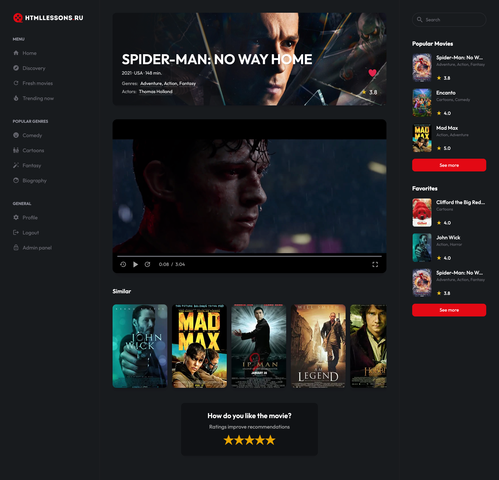

# Online Cinema

This is the README.md file for the Online Cinema Project with Admin Panel. It provides an overview of the project, its features, and instructions for setting up and running the application.
Overview

The Online Cinema Project is a web-based application that allows users to watch movies and TV shows online. It includes an admin panel that enables administrators to manage the content, user accounts, and other aspects of the system.
Features

    User Registration and Authentication: Users can create accounts and log in to the application.
    Movie and TV Show Catalog: The application provides a catalog of movies and TV shows available for streaming.
    Search and Filtering: Users can search for specific movies or TV shows and filter the results based on genre, release year, etc.
    Streaming and Playback: Users can stream movies and TV shows directly from the application and enjoy seamless playback.
    Admin Panel: Administrators have access to an admin panel where they can manage the content, including adding, editing, and deleting movies and TV shows. They can also manage user accounts and perform administrative tasks.

### Screenshot

# Technologies Used

The Online Cinema Project is built using the following technologies:

- NextJS (frontend)
- NestJS (backend)

# Installation

To set up the Online Cinema Project on your local machine, follow these steps:

- Clone the repository from GitHub: git clone [repository](https://github.com/Un1T3G/online-cinema/)
- Install PostgresSql database and import db.pgsql file
- Install the dependencies for client and server: npm install

# Admin Panel

The admin panel can be accessed by visiting the admin login page and providing the admin credentials. Once logged in, administrators can perform various administrative tasks, including managing content and user accounts.
Contributing
